```mermaid
graph TD
    classDef stream fill:#1e293b,stroke:#3b82f6,stroke-width:2px;
    classDef store fill:#1e293b,stroke:#10b981,stroke-width:2px;
    classDef compute fill:#1e293b,stroke:#8b5cf6,stroke-width:2px;
    
    G[Python Event Generator] --> K[(Kafka Cluster)]
    
    subgraph Arch_A [ARCHITECTURE A: Stream-First]
        K --> S1[PySpark Streaming Compute]:::compute
        S1 -- "Parses JSON & Enforces Schema" --> BQ[(BigQuery Structured Store)]:::store
        BQ --> DBT[dbt Micro-batch]:::compute
        DBT --> BQ_MART[(BigQuery Mart)]:::store
    end
    
    subgraph Arch_B [ARCHITECTURE B: Store-First]
        K --> S2[PySpark Raw Ingestion]:::stream
        S2 -- "Dumb Pipe: Exact Byte Copy" --> ICE_RAW[(Iceberg Raw Store)]:::store
        ICE_RAW --> S3[PySpark Batch Compute]:::compute
        S3 -- "Parses JSON & Enforces Schema" --> ICE_MART[(Iceberg Structured Store)]:::store
    end
```

# Enterprise Supply Chain & Inventory Optimization Hub
## Comprehensive Architecture Specification

This document provides a deep, technical dive into the **Dual-Architecture Streaming Pipeline**. The project evaluates two competing modern data paradigms—a **Cloud Data Warehouse** and an **Open Data Lakehouse**—by running them side-by-side against the same high-throughput, real-time data streams.

---

## 🏗️ 1. High-Level System Architecture

```mermaid
flowchart TD
    subgraph 1. Event Generation & Message Broker
        G[Python Data Generator\n(Faker + AsyncIO)] -->|JSON| K1[(Kafka: sales_events)]
        G -->|JSON| K2[(Kafka: inventory_events)]
        ZK[Zookeeper] -.->|Manages| K1
        ZK -.->|Manages| K2
    end

    subgraph 2. Architecture A: Cloud Data Warehouse (BigQuery)
        S1[PySpark Structured Stream\n(foreachBatch + Pandas)]
        K1 --> S1
        K2 --> S1
        S1 -->|Google Cloud API| BQ_RAW[(BigQuery:\nraw_supply_chain)]
        DBT[dbt-core\n(Data Build Tool)] -->|SQL / Jinja| BQ_RAW
        DBT -->|Materializes| BQ_MART[(BigQuery:\nsc_dev.fct_stream_sales_summary)]
    end

    subgraph 3. Architecture B: Open Data Lakehouse (Iceberg)
        S2[PySpark Structured Stream\n(DataFrame v2 API)]
        K1 --> S2
        K2 --> S2
        S2 -->|S3A / Parquet| ICE_RAW[(MinIO Object Store:\niceberg.sales / iceberg.inventory)]
        NESSIE[Project Nessie] -.->|Iceberg Catalog API| ICE_RAW
        TRINO[Trino SQL Engine] -->|Reads Iceberg Metadata| ICE_RAW
    end

    subgraph 4. Visualization & Control
        FASTAPI[FastAPI Backend\nProcess Manager] -->|Subprocess / taskkill| G
        FASTAPI -->|Subprocess| S1
        FASTAPI -->|Docker Exec| S2
        UI[Interactive Dashboard\nVanilla JS + Tailwind] -->|REST API| FASTAPI
        UI -->|Showdown Queries| BQ_MART
        UI -->|Showdown Queries| TRINO
    end
```

---

## 📡 2. Data Generation & Event Schemas

The `kafka_data_generator.py` script simulates a massive supply chain network generating continuous events. It uses a thread-safe Kafka producer to inject thousands of events per second into two distinct topics.

### Kafka Topic: `sales_events`
Simulates customer orders being placed across various channels.
* **Format:** JSON
* **Throughput:** ~High
* **Schema:**
  * `event_id` (UUID): Unique transaction identifier.
  * `product_id` (String): Product SKU reference.
  * `units_sold` (Int): Units ordered.
  * `revenue` (Float): Transaction value.
  * `timestamp` (Unix epoch float): Time of purchase.

### Kafka Topic: `inventory_events`
Simulates stock movements, warehouse transfers, and adjustments.
* **Format:** JSON
* **Throughput:** ~Medium
* **Schema:**
  * `event_id` (UUID): Unique movement identifier.
  * `warehouse_id` (String): Origin/Destination facility.
  * `product_id` (String): Product SKU reference.
  * `quantity_change` (Int): Positive for receipts, negative for transfers.
  * `event_type` (Enum): `RECEIPT`, `PICK`, `ADJUSTMENT`.
  * `timestamp` (Unix epoch float): Time of movement.

---

## ☁️ 3. Architecture A: BigQuery & dbt (Cloud Data Warehouse)

This architecture mimics the industry-standard ELT (Extract, Load, Transform) approach utilizing fully managed cloud services.

### Ingestion Strategy (`05_bigquery_stream.py`)
* **Framework:** PySpark 3.5 Structured Streaming
* **The Engineering Challenge:** The official Spark BigQuery connector (`spark-bigquery-with-dependencies`) relies on an older version of Google Guice for dependency injection. When running on modern JDKs (Java 11+), this causes severe bytecode shading conflicts.
* **The Solution:** We implemented a custom `foreachBatch` sink. Spark groups the streaming Kafka data into micro-batches, which are then converted to Pandas DataFrames. The native `google-cloud-bigquery` Python SDK is then used to safely and efficiently insert the data into BigQuery `raw_supply_chain` tables.

### Transformation Strategy (`dbt/`)
* **Framework:** `dbt-core` and `dbt-bigquery`
* **Workflow:** 
  1. `stg_stream_sales` and `stg_stream_inventory` act as staging layers, casting JSON strings to correct data types and extracting timestamps.
  2. `fct_stream_sales_summary` aggregates the staging data by day and product, materializing the results natively in BigQuery.

---

## 🧊 4. Architecture B: Iceberg, Nessie & Trino (Open Data Lakehouse)

This architecture represents the cutting-edge decoupling of Storage, Catalog, and Compute, allowing massive scale without vendor lock-in.

### Infrastructure Layer (Dockerized)
* **Storage (MinIO):** A local S3-compatible object store holds all data in the open Apache Parquet format.
* **Catalog (Project Nessie):** Acts as the meta-store for Iceberg. Nessie provides Git-like capabilities for data lakes (branching, tagging, atomic commits), ensuring that Spark and Trino stay perfectly synchronized when reading/writing to the data lake.
* **Compute (Trino):** A massively parallel SQL query engine designed to read Iceberg tables directly from object storage without moving the data.

### Ingestion Strategy (`04_iceberg_stream.py`)
* **Framework:** PySpark 3.5 running inside a Dockerized Spark Cluster (`spark-master`).
* **Workflow:** Uses the native Iceberg DataFrame v2 API (`.writeStream.format("iceberg").outputMode("append")`) to continually commit new streaming data directly into `nessie.sales.streaming_events`.

### Transformation Strategy (The Trino Pivot)
* **The Engineering Challenge:** Originally designed to run batch aggregations via PySpark SQL (`CREATE TABLE AS SELECT`), we encountered a fatal JVM HotSpot C2 compiler bug (`signature.cpp:53 expecting (`) specific to Java 11 when compiling certain AWS SDK multi-release JAR lambdas. 
* **The Solution:** We bypassed Spark entirely for the transformation phase. We embraced the true nature of a decoupled Lakehouse by utilizing **Trino** to dynamically query and aggregate the raw Iceberg tables on-the-fly. Trino operates on Java 17/21 and parses the Iceberg metadata instantaneously, executing massive aggregations without crashing.

---

## 🎛️ 5. The Interactive Web Dashboard

To unify the control and visualization of these dual pipelines, a custom web dashboard was built.

* **Backend (FastAPI):** A lightweight Python server acting as the process manager. It uses the `subprocess` module to asynchronously launch the Python generator, PySpark streams, and dbt runs. It implements custom `taskkill /T` tree-killing commands to safely terminate complex Docker processes on Windows without leaving ghost/zombie processes.
* **Metrics API:** Two dedicated endpoints (`/api/metrics/showdown` and `/api/metrics/live`) query BigQuery and Trino simultaneously. They track row counts and calculate live ingestion throughput (events per second) using highly optimized metadata queries (`__TABLES__` in BigQuery and `COUNT(*)` in Trino).
* **Frontend (Vanilla JS + Tailwind):** A dark-mode, single-page application served by FastAPI. It utilizes `Mermaid.js` to render the architectural diagram and relies on AJAX polling to dynamically update the UI state, counters, and showdown matrix in real-time without refreshing the browser.

---

## 🌐 6. Network & Port Mapping

The local Docker network (`app-tier`) exposes the following services for local development and integration:

| Service | Host Port | Internal Port | Description |
|:---|---:|---:|:---|
| **FastAPI Dashboard** | `8000` | `8000` | Interactive UI and Process API |
| **Kafka Broker** | `9092` | `29092` | Event streaming bus |
| **Zookeeper** | `2181` | `2181` | Kafka cluster coordination |
| **MinIO (S3)** | `9000` | `9000` | Local object storage |
| **MinIO Console** | `9001` | `9001` | S3 Web UI |
| **Project Nessie** | `19120` | `19120` | Iceberg Catalog REST API |
| **Trino** | `8080` | `8080` | Distributed SQL query engine |
| **Spark Master** | `8081` | `8081` | Spark Cluster UI |

---

## 📂 7. Project File Structure

```text
├── Asset/                        # PowerBI dashboard files & PDFs
├── dashboard/                    # FastAPI and UI for the control panel
├── dbt/                          # dbt project for Architecture A
│   ├── models/                   # dbt SQL models (staging, intermediate, marts)
│   └── dbt_project.yml
├── docker/                       # Docker initialization scripts (Trino, S3, etc.)
├── docker-compose.yml            # Core infrastructure for the showdown
├── docs/                         # Extensive project documentation & ADRs
├── orchestration/                # Airflow DAGs
├── powerbi/                      # DAX measures and model definitions
├── pyspark_jobs/                 # PySpark code for architectures
│   ├── complex_transforms/       # Batch transformation logic
│   ├── streaming/                # Streaming jobs (Iceberg vs BigQuery)
│   └── utils/                    # Spark session and logging utilities
├── scripts/                      # Utility scripts (Kafka generator, setup, etc.)
└── tests/                        # Data validation and tests
```


---

## 🏗️ 8. Target Architecture Evolution (Stream-First vs Store-First)

Currently, the project evaluates BigQuery and Iceberg using structurally similar data flows (Spark acts as an ingestion mechanism for both). A future architectural migration is planned to convert this into a strict **Stream-First** vs **Store-First** conceptual comparison.

### The Architectural Problem
1. **Architecture A (BigQuery) currently acts as Store-First:** Spark acts merely as a dumb ingestion pipe. The actual computation and schema enforcement (parsing the JSON) happens *after* durable storage via dbt.
2. **Architecture B (Iceberg) currently acts as Stream-First:** Spark enforces the schema and parses the JSON payload *before* the data lands in Iceberg.

### The Target Design

To achieve a true comparison, the computational boundaries will be swapped:

**Stream-First (Architecture A - BigQuery)**
Computation happens *in-flight*.
* **Streaming Compute:** PySpark parses JSON, enforces schemas, and validates data *before* storage.
* **Structured Storage:** BigQuery holds the fully typed, structured data.
* **Lightweight Analytics:** dbt performs final aggregations.

**Store-First (Architecture B - Iceberg)**
Computation happens *after* durable storage.
* **Raw Durable Store:** PySpark is refactored into a "Dumb Pipe Writer", writing exact raw Kafka JSON strings to Iceberg without parsing them.
* **Batch/Micro-Batch Compute:** A secondary Spark or Trino job reads the Iceberg Raw tables, parses the JSON, and loads it into structured Iceberg Marts.

### Design Decisions & Constraints
* **Store-First Ingestion Mechanism:** Rather than introducing heavy infrastructure like Kafka Connect, the existing PySpark Structured Streaming job will be stripped of all rom_json processing. It will serve exclusively as a byte-for-byte persistent ingestion layer, aligning perfectly with the store-first paradigm while remaining lightweight.
* **Comparison Integrity:** Both architectures will continue to process the exact same Kafka source events and volume, allowing an honest comparison of **Time to Durable Storage** vs. **Time to Structured Insights**.

`mermaid
graph TD
    classDef stream fill:#1e293b,stroke:#3b82f6,stroke-width:2px;
    classDef store fill:#1e293b,stroke:#10b981,stroke-width:2px;
    classDef compute fill:#1e293b,stroke:#8b5cf6,stroke-width:2px;
    
    G[Python Event Generator] --> K[(Kafka Cluster)]
    
    subgraph Arch_A [ARCHITECTURE A: Stream-First]
        K --> S1[PySpark Streaming Compute]:::compute
        S1 -- "Parses JSON & Enforces Schema" --> BQ[(BigQuery Structured Store)]:::store
        BQ --> DBT[dbt Micro-batch]:::compute
        DBT --> BQ_MART[(BigQuery Mart)]:::store
    end
    
    subgraph Arch_B [ARCHITECTURE B: Store-First]
        K --> S2[PySpark Raw Ingestion]:::stream
        S2 -- "Dumb Pipe: Exact Byte Copy" --> ICE_RAW[(Iceberg Raw Store)]:::store
        ICE_RAW --> S3[PySpark Batch Compute]:::compute
        S3 -- "Parses JSON & Enforces Schema" --> ICE_MART[(Iceberg Structured Store)]:::store
    end
`


---

## 🏗️ 8. Target Architecture Evolution (Stream-First vs Store-First)

Currently, the project evaluates BigQuery and Iceberg using structurally similar data flows (Spark acts as an ingestion mechanism for both). A future architectural migration is planned to convert this into a strict **Stream-First** vs **Store-First** conceptual comparison.

### The Architectural Problem
1. **Architecture A (BigQuery) currently acts as Store-First:** Spark acts merely as a dumb ingestion pipe. The actual computation and schema enforcement (parsing the JSON) happens *after* durable storage via `dbt`.
2. **Architecture B (Iceberg) currently acts as Stream-First:** Spark enforces the schema and parses the JSON payload *before* the data lands in Iceberg.

### The Target Design

To achieve a true comparison, the computational boundaries will be swapped:

**Stream-First (Architecture A - BigQuery)**
Computation happens *in-flight*.
* **Streaming Compute:** PySpark parses JSON, enforces schemas, and validates data *before* storage.
* **Structured Storage:** BigQuery holds the fully typed, structured data.
* **Lightweight Analytics:** dbt performs final aggregations.

**Store-First (Architecture B - Iceberg)**
Computation happens *after* durable storage.
* **Raw Durable Store:** PySpark is refactored into a "Dumb Pipe Writer", writing exact raw Kafka JSON strings to Iceberg without parsing them.
* **Batch/Micro-Batch Compute:** A secondary Spark or Trino job reads the Iceberg Raw tables, parses the JSON, and loads it into structured Iceberg Marts.

### Design Decisions & Constraints
* **Store-First Ingestion Mechanism:** Rather than introducing heavy infrastructure like Kafka Connect, the existing PySpark Structured Streaming job will be stripped of all `from_json` processing. It will serve exclusively as a byte-for-byte persistent ingestion layer, aligning perfectly with the store-first paradigm while remaining lightweight.
* **Comparison Integrity:** Both architectures will continue to process the exact same Kafka source events and volume, allowing an honest comparison of **Time to Durable Storage** vs. **Time to Structured Insights**.


