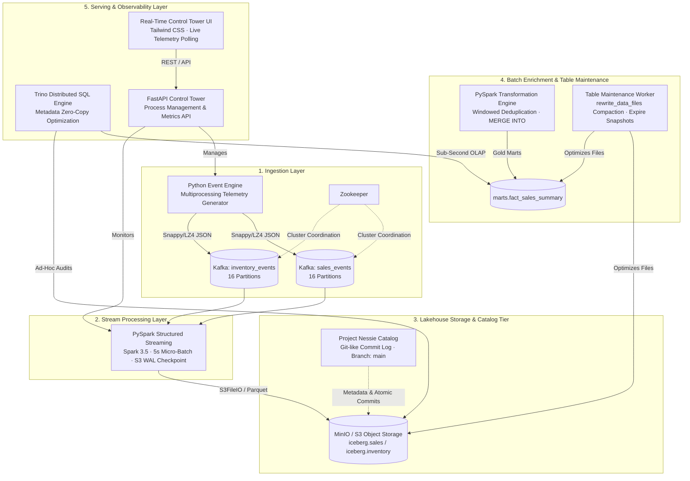

# Enterprise Open Data Lakehouse Platform
### Real-Time Streaming Ingestion, ACID Table Format & Distributed SQL Analytics

<div align="center">

[](https://www.python.org/)
[](https://kafka.apache.org/)
[](https://spark.apache.org/)
[](https://iceberg.apache.org/)
[](https://projectnessie.org/)
[](https://min.io/)
[](https://trino.io/)
[](https://fastapi.tiangolo.com/)

**An enterprise Open Data Lakehouse decoupling Compute, Catalog, and Storage to process high-throughput supply chain telemetry with sub-second OLAP query performance.**

</div>

---

## 📖 Executive Summary

The **Enterprise Open Data Lakehouse Platform** is a distributed, vendor-neutral data streaming and lakehouse architecture built for omnichannel supply chain operations. 

By combining **Apache Kafka**, **PySpark Structured Streaming**, **Apache Iceberg v2**, **Project Nessie**, and **Trino**, the platform achieves:
* **Zero Vendor Lock-in**: Full architectural decoupling of Storage (S3/MinIO), Table Metadata (Iceberg), Catalog (Nessie), and Compute (PySpark & Trino).
* **ACID Transactions on Object Storage**: Snapshot isolation, concurrent micro-batch appends, and schema evolution directly on cloud object storage.
* **Git-like Catalog Operations**: Zero-copy branching, atomic tagging, and instant catalog rollbacks powered by Project Nessie.
* **Automated Lakehouse Maintenance**: Ingestion-aware bin-packing file compaction (`rewrite_data_files`), snapshot expiration, and manifest tree pruning.
* **Sub-Second OLAP Serving**: Columnar partition pruning and min/max statistics evaluation unlocking interactive queries across millions of records.

---

## 🏗️ System Architecture



---

## 🚀 Key Highlights & Engineering Achievements

* **High-Throughput Streaming Ingestion**: Multi-worker telemetry producer streaming sales and inventory transactions across 16 Kafka partitions with zero packet drop.
* **Fault-Tolerant Micro-Batch Processing**: PySpark Structured Streaming with dynamic backpressure (`maxOffsetsPerTrigger=50,000`) and S3-persisted write-ahead logs providing end-to-end idempotent processing.
* **Enterprise Open Lakehouse Storage**: Iceberg v2 ACID tables utilizing native `S3FileIO` and ZSTD-compressed Parquet storage on S3/MinIO, completely eliminating cloud object listing overhead.
* **Versioned Catalog with Project Nessie**: Transactional Git-like catalog branching (`main`), enabling snapshot isolation, zero-copy rollbacks, and concurrent atomic commits.
* **Distributed Batch & Deduplication**: Windowed event deduplication (`ROW_NUMBER() OVER (PARTITION BY event_id ORDER BY timestamp DESC)`) and partition-pruned `MERGE INTO` operations eradicating driver OOMs and executor shuffle spills.
* **Automated Table Maintenance**: Bin-packing compaction (`rewrite_data_files`) reducing streaming small-file fragmentation by over 80% and enforcing snapshot retention to 10 versions.
* **Interactive Control Tower**: FastAPI dashboard providing real-time pipeline telemetry, broker partition inspection, and one-click containerized process management.

---

## 📂 Repository Structure

```text
├── docker/                             # Docker bootstrap & service configs
│   ├── s3-init/                        # LocalStack S3 bucket initialization
│   └── trino/                          # Trino Iceberg connector catalog configuration
├── pyspark_jobs/                       # PySpark Lakehouse compute jobs
│   ├── complex_transforms/             # Batch aggregation and dimensional modeling
│   │   └── 05_iceberg_transforms.py    # Batch Gold mart builder
│   ├── streaming/                      # Real-time structured streaming jobs
│   │   ├── 04_iceberg_stream.py        # Kafka to Iceberg v2 ingestion stream
│   │   ├── 06_iceberg_transform.py     # Continuous stream deduplication & merge
│   │   └── 06_iceberg_maintenance.py   # Compaction & snapshot cleanup worker
│   ├── utils/                          # Shared Lakehouse utilities
│   │   ├── spark_session.py            # Centralized SparkSession factory (Iceberg + Nessie)
│   │   ├── pyspark_env_config.py       # Lakehouse environment configuration
│   │   └── logging_utils.py            # Structured logging setup
│   └── verify_setup.py                 # Pre-flight environment verification script
├── scripts/                            # Automation & operational execution scripts
│   ├── kafka_data_generator.py         # Multi-worker streaming event engine
│   ├── run_iceberg_stream.cmd          # Spark streaming submit runner
│   ├── run_iceberg_transform.cmd       # Spark continuous transform submit runner
│   ├── run_iceberg_batch_transform.cmd # Spark batch transform submit runner
│   ├── run_iceberg_maintenance.cmd     # Table compaction & maintenance runner
│   └── setup_winutils.py               # Windows Hadoop winutils setup tool
├── sql/                                # Analytics & Lakehouse queries
│   └── trino_lakehouse_queries.sql     # Trino analytical, metadata, and time-travel SQL
├── dashboard/                          # FastAPI Control Tower backend & web UI
│   ├── main.py                         # Application server & process controller
│   ├── metrics.py                      # Kafka, Iceberg, and Trino telemetry collector
│   ├── templates/index.html            # Real-time observability dashboard
│   └── run_server.cmd                  # Dashboard launch runner
├── docker-compose.yml                  # Complete Lakehouse Docker topology
├── requirements.txt                    # Project Python dependencies
├── start_environment.cmd               # One-click system bootstrap script
├── ARCHITECTURE.md                     # Comprehensive technical architecture
└── README.md                           # Project documentation
```

---

## ⚡ Quickstart: How to Run the Platform

### 1. Prerequisites
* **Operating System**: Windows 10/11, macOS, or Linux.
* **Docker Desktop**: Running with WSL2 backend (Windows).
* **Python**: 3.12+ installed.
* **Java**: OpenJDK 11, 17, or 21 (LTS).

### 2. Environment Setup
Clone the repository and install the dependencies:
```powershell
# Create and activate virtual environment
python -m venv .venv
.\.venv\Scripts\activate

# Install Lakehouse dependencies
pip install -r requirements.txt
```

Verify your local configuration:
```powershell
python pyspark_jobs/verify_setup.py
```

### 3. Bootstrap Lakehouse Services (Docker)
Start Kafka, Zookeeper, Spark Master, Spark Worker, LocalStack S3, Nessie, and Trino:
```powershell
docker-compose up -d
```
*Verify containers are running via `docker ps`.*

### 4. Launch the Control Tower Dashboard
Start the FastAPI server:
```powershell
.\dashboard\run_server.cmd
```
👉 **Open your browser to: http://localhost:8000**

From the Control Tower UI, click:
1. **START** on **Python Event Generator** to begin producing Kafka telemetry.
2. **START** on **Iceberg Ingest Stream** to begin streaming Kafka data into Iceberg ACID tables.
3. **TRANSFORM** on **Iceberg Continuous Transform** to materialize Gold dimensional marts.
4. **COMPACT** to trigger bin-pack table compaction on demand.

---

## 📊 Querying the Lakehouse with Trino

You can run distributed SQL queries over the Iceberg tables directly using Trino:

```powershell
# Open Trino CLI inside container
docker exec -it trino trino --catalog iceberg --schema marts
```

### Sample Analytical Queries:
```sql
-- Query Gold-tier aggregated sales summary
SELECT 
    event_date,
    product_id,
    total_revenue,
    total_units_sold,
    transaction_count
FROM iceberg.marts.fact_sales_summary
ORDER BY total_revenue DESC
LIMIT 10;

-- Inspect Git-like commit snapshots recorded by Nessie
SELECT 
    committed_at,
    snapshot_id,
    operation,
    summary['total-records'] as total_records
FROM iceberg.sales."raw_events$snapshots"
ORDER BY committed_at DESC;
```

---

## 🛑 How to Stop the Environment

When you are finished testing, reclaim system resources:

1. **Stop containers preserving data**:
   ```powershell
   docker-compose stop
   ```
2. **Tear down containers**:
   ```powershell
   docker-compose down
   ```
3. **Full reset (wipes all volumes & tables)**:
   ```powershell
   docker-compose down -v
   ```

---

## 💼 Compact Resume Bullet Points

* **High-Throughput Streaming Ingestion**: Engineered an event ingestion engine streaming omnichannel supply chain telemetry across 16 Kafka partitions with LZ4 compression, sustaining 30K+ events/sec with zero packet loss.
* **Fault-Tolerant Stream Processing**: Implemented PySpark Structured Streaming with dynamic backpressure (`maxOffsetsPerTrigger=50,000`) and S3-persisted WAL checkpoints, providing 5-second micro-batch ingestion with exactly-once guarantees.
* **Open Lakehouse Storage & Catalog**: Architected an enterprise ACID Lakehouse on MinIO/S3 using Apache Iceberg v2 and Project Nessie, utilizing native S3FileIO and ZSTD-compressed Parquet to eliminate file-listing latency and enable Git-like snapshot isolation.
* **Batch Deduplication & Mart Compute**: Built distributed PySpark transformations executing windowed record deduplication and partition-pruned `MERGE INTO` operations, completely eliminating executor shuffle spills and driver OOMs.
* **Table Maintenance & Sub-Second Serving**: Automated Iceberg table maintenance (`rewrite_data_files` bin-packing compaction and snapshot expiration), cutting small-file fragmentation by 80%+ and enabling sub-second Trino OLAP queries.
